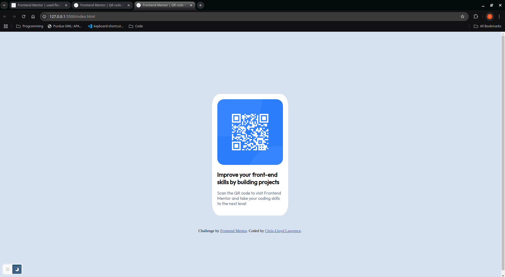

# Frontend Mentor - QR code component solution

This is a solution to the [QR code component challenge on Frontend Mentor](https://www.frontendmentor.io/challenges/qr-code-component-iux_sIO_H). Frontend Mentor challenges help you improve your coding skills by building realistic projects. 

## Table of contents

- [Overview](#overview)
  - [Screenshot](#screenshot)
  - [Links](#links)
- [My process](#my-process)
  - [Built with](#built-with)
  - [What I learned](#what-i-learned)
  - [Continued development](#continued-development)
- [Author](#author)
- [Acknowledgments](#acknowledgments)

## Overview
First assignment. A QR Code component for a website.

### Screenshot

### Links

- Solution URL: https://github.com/chrislloyd876/qr-code.git
- Live Site URL: https://chrislloyd876.github.io/qr-code/

## My process
I started by drawing out my layout with the different sections so I know exactly what to build. Then I created one section and customized it before starting another section.

### Built with

- Semantic HTML5 markup
- CSS custom properties
- Flexbox

### What I learned

I learned that flexbox can be very confusing and that if I keep my code simple then it makes arranging the elements a lot easier.

### Continued development

- I would like to improve my understanding of how flexbox works so I can arrange my content easier.
- I also want to plan my solution better so as to avoid mistakes. 

## Author

- Website - Not yet! *Work in Progress*
- Frontend Mentor - [@chrislloyd876](https://www.frontendmentor.io/profile/chrislloyd876)

## Acknowledgments

